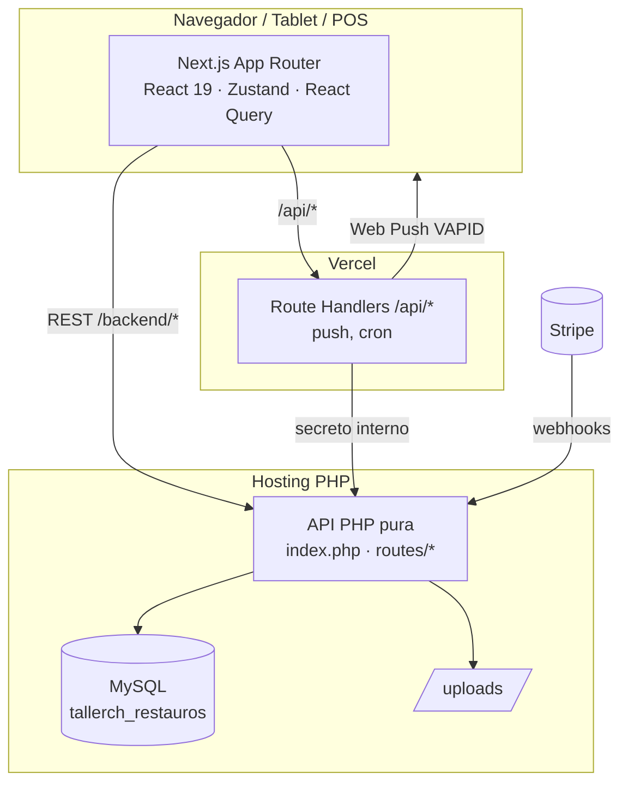
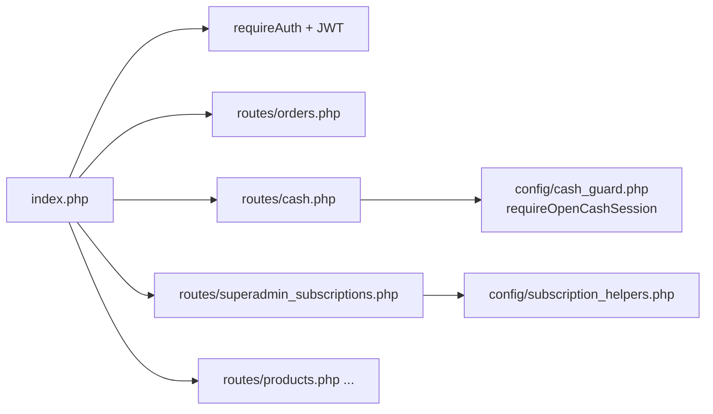

# Arquitectura — RestaurOS

Visión técnica del sistema para desarrolladores.

> 📚 Para el stack completo (versiones exactas, integraciones, diagramas de
> autenticación, ejecución de promociones, bot de WhatsApp, tiempo real,
> modelo de datos, planes y deuda técnica conocida), ver
> **[docs/STACK.md](STACK.md)** — este documento se mantiene como resumen corto.

## Resumen

RestaurOS es una app **Next.js 15 (App Router, React 19)** en el frontend y un **backend en PHP puro** sobre **MySQL**. El frontend habla con el backend vía REST bajo el prefijo `/backend` (proxy). Hospedaje en **Vercel** (frontend + crons); el backend PHP corre en hosting propio.



## Frontend

- **Next.js 15 / React 19**, TypeScript, **Tailwind CSS**.
- Estado: **Zustand** (`lib/stores/*`: auth, cart, orders, sales, tables, config, printer, alerts).
- Datos remotos: **@tanstack/react-query** (`lib/api/queries`), cliente HTTP en `lib/api/client.ts` (token JWT en `localStorage`, headers `X-Device-Uid` y `X-Pos-Id`).
- UI: **Radix UI** + componentes propios (`components/ui`), **lucide-react**, **Recharts**, **sonner** (toasts), **next-themes** (claro/oscuro).
- Tiempo real: polling selectivo por pantalla (pedidos, mesas, cocina, caja, dispositivos) + **Web Push**; sin polling global para escalar con muchos POS.
- Rutas principales: grupo `(dashboard)` (operación), `(kitchen-station)` (KDS), `superadmin` (panel SaaS), `carta` (carta QR pública), `landing`.

## Backend (PHP)

- Entrada única: `php-backend/index.php` enruta por el primer segmento a `routes/*.php`.
- Config en `php-backend/config/*`: `database.php`, `jwt.php`, `cors.php`, `auth.php`, `audit.php`, `cash_guard.php`, `stripe.php`, `subscription_helpers.php`.
- Sin framework: PDO + funciones. Respuestas JSON (`jsonResponse`/`jsonError`).



## Autenticación y roles

- Login emite un **JWT** (`sub`, `role`, `branch_id`). El frontend lo guarda y lo manda en `Authorization: Bearer`.
- Roles: `superadmin`, `admin`, `mesero`, `cocina` (cocina con `station` hot/cold/both).
- `requireAuth()` valida el token; `requireRole()` restringe rutas (ej. superadmin).
- Dispositivos: cada equipo se identifica con `X-Device-Uid`; el admin los aprueba/bloquea.

## Caja y turnos

- Tabla `cash_sessions` = turno de **usuario + POS** (`branch_id`, `pos_id`, `opened_by`, estados open/closed).
- Guard **`requireOpenCashSession()`** (`config/cash_guard.php`) en backend: bloquea cobro, movimientos de efectivo y cierre sin caja abierta (HTTP 409 `cash_session_required`).
- Frontend: el POS viaja en `X-Pos-Id`; un handler global abre el modal de apertura ante un 409. Ver [Guía de Caja](CASHIER_GUIDE.md).

## Pedidos

- `orders` + `order_items` + `order_payments`. Totales recalculados en servidor (no se confía en el cliente). Soporta precio fijo/abierto/por kg, modificadores, divisiones de cuenta (`bill_splits`) e IVA incluido.
- Cobro liga el pago al `cash_session_id` y `pos_id`.

## Inventario

- Insumos, recetas/ingredientes; al vender se descuenta stock (`deductRecipeStock`).

## Facturación / Suscripciones

- `subscriptions`, `subscription_payments` (con meses cubiertos), `subscription_calendar` (caché), `subscription_audit_log`, `bank_transfer_config`.
- Cron diario (`subscription_cron.php`) aplica vencimiento anclado al día 1 + **periodo de gracia**. Ver [Billing](BILLING.md) y [Licencias](LICENSE_SYSTEM.md).

## Tiempo real

- **Web Push (VAPID)**: el backend pide a un Route Handler de Next.js (`/api/push/*`, secreto `PUSH_INTERNAL_SECRET`) firmar y entregar notificaciones (nuevo pedido a cocina, avisos de suscripción).
- Polling por pantalla con `refetchInterval` solo cuando la pestaña está visible.

## Estructura del proyecto (resumen)

```
app/            Rutas Next.js (dashboard, kitchen-station, superadmin, carta, landing, api)
components/     UI por dominio (orders, tables, cash, kitchen, superadmin/billing, ui…)
hooks/          Hooks (printer, realtime, session, device heartbeat…)
lib/            stores, api/queries, constants, types, pos, printing, supabase, utils
php-backend/    index.php, config/, routes/, migrations/, schema.sql
docs/           Esta documentación
```

📖 Relacionado: [Instalación](INSTALLATION.md) · [Despliegue](DEPLOYMENT.md) · [API](API.md)
