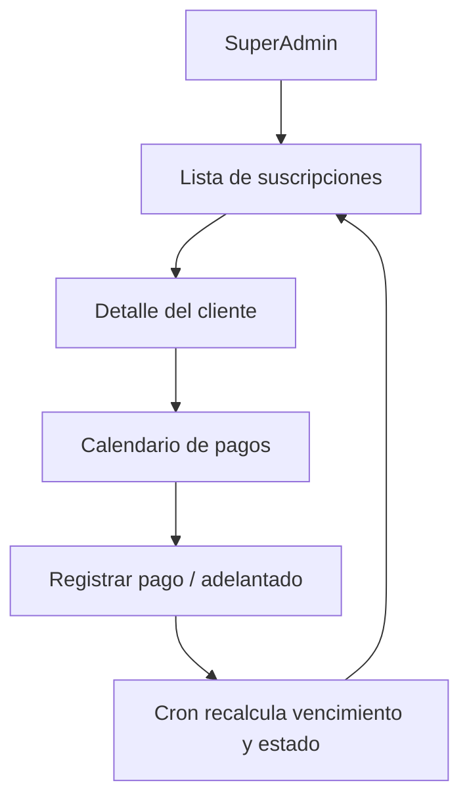

# Facturación / Billing CRM

Cómo el **superadmin** cobra y administra las suscripciones de cada sucursal: calendario de pagos, pagos manuales y adelantados, periodo de gracia y métodos de pago (Stripe / SPEI / transferencia).

> [← Volver al índice](README.md) · Relacionado: [Sistema de Licencias](LICENSE_SYSTEM.md) · [Guía de SuperAdmin](SUPERADMIN_GUIDE.md)

---

## Panorama

Billing CRM vive en `/superadmin/subscriptions`. Backend: `php-backend/routes/superadmin_subscriptions.php`, `subscription.php`, `subscription_cron.php` y `billing.php`. Migración base: `php-backend/migrations/24-billing-crm.sql`.

---

## Calendario de pagos

Cada suscripción tiene un **calendario mensual híbrido**: muestra los meses cubiertos, el mes en curso y los meses pendientes/futuros. El estado de cada celda usa `CalendarCellStatus`.

- **Cubierto** — pago registrado para ese mes.
- **Actual** — periodo vigente.
- **Pendiente / Vencido** — sin pago, dentro o fuera de la gracia.

---

## Métodos de pago

Definidos en `lib/constants/subscription.ts` (`PAYMENT_METHOD_LABEL`):

| Método | Descripción |
|--------|-------------|
| `transfer` / `bank_transfer` | Transferencia bancaria (manual) |
| `spei` | SPEI (referencia/intent) |
| Stripe | Tarjeta (suscripción recurrente, webhooks) |

Los pagos por transferencia/SPEI pasan por estados `pending_bank_transfer` → `bank_transfer_review` → confirmado.

---

## Registrar un pago

1. SuperAdmin → **Suscripciones** → abre el cliente.
2. Pestaña **Calendario** → **Registrar pago**.
3. Elige método, monto y **número de meses a cubrir** (1 = mensual; >1 = **pago adelantado**).
4. Confirma. El sistema marca los meses cubiertos y **recalcula la fecha de vencimiento**.

### Pago adelantado

Cubrir varios meses de una vez: al registrar el pago indica los meses (p. ej. `4`). El calendario marca los 4 meses y el vencimiento se desplaza en consecuencia. Útil para clientes que pagan trimestral/anual.

---

## Periodo de gracia

Al vencer la suscripción, la sucursal entra en **gracia** (configurable, por defecto **5 días**) conservando el acceso. Si no hay pago al terminar la gracia, el cron la **suspende** automáticamente. Detalle de estados en [Sistema de Licencias](LICENSE_SYSTEM.md).

---

## Acciones del superadmin

| Acción | Efecto |
|--------|--------|
| **Activar** | Pone la suscripción en `active` |
| **Suspender** | Bloquea el acceso operativo |
| **Cancelar** | Acceso hasta el fin del periodo pagado |
| **Reactivar** | Restaura el acceso tras un pago |
| **Dar de baja** | `terminated`, definitivo |

---

## Automatización (cron)

`subscription-cron` (endpoint backend, invocado por `app/api/cron`) recalcula a diario: días restantes, transición a `past_due`, aplicación de la gracia y suspensión. Configuración de despliegue en [DEPLOYMENT.md](DEPLOYMENT.md).
