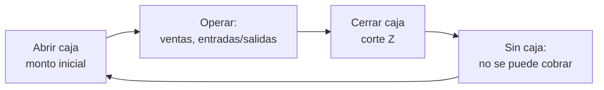

# Guía de Caja — FoodIX

Cómo operar la **caja y los turnos**. La caja no es un rol aparte: la operan **admin** y **mesero**. Es **obligatoria** para cobrar.

> Menú → **Caja**.

## ¿Por qué es obligatoria?

FoodIX bloquea **cobrar, registrar pagos y mover efectivo** si no hay una **caja abierta (turno)**. Así, cada venta queda ligada a un **usuario + POS**, y el corte del día cuadra sin mezclar turnos.

## 1. Abrir caja / iniciar turno

1. Entra a **Caja** → **Abrir caja**.
2. Captura el **monto inicial** (fondo de caja).
3. Opcional: una **nota**.
4. **Iniciar turno**.

Verás el indicador **"Caja abierta"** (hora + POS) en el Topbar. Solo puede haber **una caja abierta por POS** a la vez.

## 2. Registrar ventas
Los cobros de pedidos se ligan **automáticamente** a tu turno. No necesitas hacer nada extra: cobra normal desde el pedido.

## 3. Entradas y salidas de efectivo
> Caja → **Entrada** / **Salida**.

- **Entrada**: dinero que ingresa fuera de ventas (ej. fondo adicional).
- **Salida**: dinero que sale (ej. pago a proveedor, retiro).

Captura monto y motivo. Afectan el **efectivo esperado** del corte.

## 4. Corte y cierre (Corte Z)
> Caja → **Cerrar caja (Corte Z)**.

El sistema calcula:

| Concepto | Detalle |
|----------|---------|
| Fondo inicial | El monto con que abriste |
| + Ventas en efectivo | Cobros en efectivo del turno |
| + Entradas | Entradas de efectivo |
| − Salidas | Salidas de efectivo |
| = **Efectivo esperado** | Lo que debería haber en caja |
| Efectivo contado | Lo que **tú** capturas |
| **Diferencia** | Contado − esperado |

También muestra pagos con **tarjeta**, **transferencias**, ventas totales, **descuentos** y **cancelaciones** del turno.

1. Cuenta el efectivo y captúralo.
2. Revisa la diferencia.
3. Confirma: el turno se cierra (estado **CLOSED**, con fecha de cierre).

Después de cerrar, **no se puede cobrar** hasta abrir un nuevo turno.

## Errores comunes
- *"Necesitas abrir caja"* al cobrar → abre el turno primero.
- *"Ya hay una caja abierta en este POS"* → cierra el turno anterior antes de abrir otro.
- Diferencia negativa grande → revisa entradas/salidas no registradas o cobros mal capturados.

📖 Relacionado: [Solución de Problemas](TROUBLESHOOTING.md) · [Manual de Usuario](USER_MANUAL.md)
