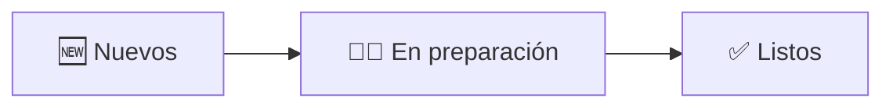

# Guía de Cocina (KDS) — FoodIX

La pantalla **KDS** (Kitchen Display System) muestra los pedidos en tiempo real para que cocina los prepare sin papel.

> Acceso: usuario de rol **cocina** (o admin). Menú → **Cocina**.

## Vistas y estaciones

| Vista | Ruta | Muestra |
|-------|------|---------|
| Vista completa | `/kitchen` | Todos los pedidos |
| Estación Caliente 🔥 | `/kitchen/hot` | Solo platillos calientes |
| Estación Fría / Bar 🧊 | `/kitchen/cold` | Solo fríos / bebidas |

Si tu usuario está asignado a una estación (**Caliente** o **Fría**), verás solo la tuya. El admin las ve todas.

## Flujo de preparación

1. **Pedidos nuevos** aparecen automáticamente (con sonido/alerta).
2. Toca un ítem o pedido para marcarlo **En preparación**.
3. Cuando esté terminado, márcalo **Listo**.
4. El mesero recibe la señal de que puede recoger/servir.

## Detalles útiles

- **Tiempo de preparación**: cada pedido muestra cuánto lleva esperando, para priorizar.
- **Filtros**: por estación (Caliente/Frío) y estado (nuevos, en preparación, listos).
- **Tiempo real**: la pantalla se actualiza sola. Si la dejaste en segundo plano mucho tiempo, **recárgala** al volver.
- **Productos por kilo / abiertos**: muestran su nota; el precio final se confirma en caja.
- **Modificadores y notas** del mesero se ven junto a cada producto (ej. *término medio*, *sin cebolla*).

## Si algo falla
- **No llegan pedidos** → revisa conexión a internet y notificaciones; recarga la pantalla.
- **Sin sonido** → revisa el volumen del dispositivo y permisos de audio del navegador.

📖 Relacionado: [Solución de Problemas](TROUBLESHOOTING.md) · [FAQ](FAQ.md)
