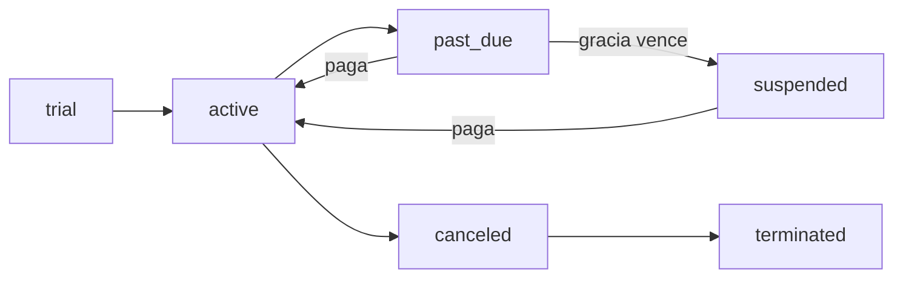

# Sistema de Licencias

Cómo FoodIX deriva los **límites y funcionalidades** de cada sucursal a partir de su **plan**.

> [← Volver al índice](README.md) · Relacionado: [Billing CRM](BILLING.md) · [Guía de SuperAdmin](SUPERADMIN_GUIDE.md)

---

## Planes

La licencia se deriva del plan de la suscripción (sin tabla dedicada en esta fase). Fuente de verdad: `php-backend/config/subscription_helpers.php` → `licenseForPlan()`.

| Plan | Usuarios | POS | Sucursales | Funcionalidades |
|------|:--------:|:---:|:----------:|-----------------|
| **trial** | 3 | 1 | 1 | POS, KDS, Reportes |
| **basic** | 5 | 1 | 1 | + Inventario |
| **pro** | 15 | 2 | 3 | + Clientes, Caja |
| **enterprise** | ∞ | 5 | 10 | + Multi-sucursal, API |

> `-1` significa **ilimitado**. Los límites son acumulativos: cada plan superior incluye las funcionalidades del anterior.

### Funcionalidades (`features`)

| Clave | Módulo |
|-------|--------|
| `pos` | Punto de venta / pedidos |
| `kds` | Pantalla de cocina |
| `reports` | Reportes y ventas |
| `inventory` | Inventario, recetas, compras |
| `customers` | Clientes y reservaciones |
| `cash` | Caja y turnos |
| `multi_branch` | Varias sucursales |
| `api` | Acceso a API |

---

## Estados de suscripción

Definidos en `lib/constants/subscription.ts`. Los estados que **permiten operar** son `active`, `trial` y `past_due` (`SUBSCRIPTION_ALLOWED`).

| Estado | Etiqueta | ¿Opera? |
|--------|----------|:-------:|
| `active` | Activa | ✅ |
| `trial` | Prueba | ✅ |
| `past_due` | Por vencer | ✅ (con aviso) |
| `payment_failed` | Pago fallido | ⚠️ |
| `pending_bank_transfer` | Transferencia pendiente | ⚠️ |
| `bank_transfer_review` | En revisión | ⚠️ |
| `suspended` | Suspendida | ❌ |
| `canceled` | Cancelada | hasta fin de periodo |
| `terminated` | Dada de baja | ❌ |
| `expired` | Vencida | ❌ |

---

## Ciclo de vida

1. **Prueba (`trial`)** → la sucursal opera con límites del plan trial.
2. **Activa (`active`)** tras el primer pago.
3. **Por vencer (`past_due`)** al acercarse el vencimiento; entra el **periodo de gracia** (configurable, por defecto 5 días) conservando el acceso.
4. **Suspendida** automáticamente al agotar la gracia sin pago. El acceso operativo se bloquea.
5. **Cancelada / Dada de baja** según la decisión del superadmin.

El cron de suscripciones (`subscription-cron`) recalcula vencimientos y transiciones. Ver [Billing CRM](BILLING.md).
