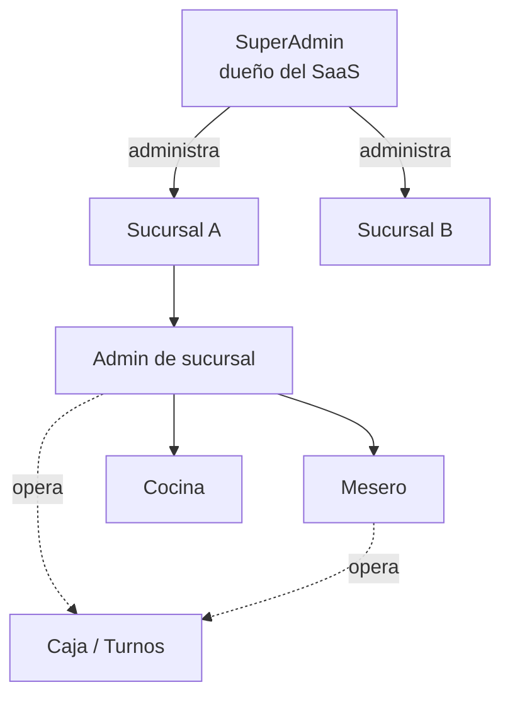

# Documentación de RestaurOS

**RestaurOS** es el sistema operativo para restaurantes de **DevHive Software**: punto de venta (POS), cocina (KDS), caja y turnos, carta digital QR, inventario, clientes, reportes y un panel SaaS de administración de suscripciones (Billing CRM).

> Versión documentada: **1.0.0-beta.117** · Última actualización: **2026-07-10**

Esta carpeta concentra toda la documentación, organizada para **clientes finales**, **administradores** y **desarrolladores**. Todos los documentos están en español y enlazados entre sí.

---

## 🧭 Mapa de la documentación

### Para usar el sistema (clientes finales)

| Documento | ¿Para quién? | Contenido |
|-----------|--------------|-----------|
| [Manual de Usuario](USER_MANUAL.md) | Todos | Recorrido completo paso a paso, de cero a operar |
| [Guía de Administrador](ADMIN_GUIDE.md) | Admin de sucursal | Productos, inventario, mesas, caja, usuarios, reportes |
| [Guía de SuperAdmin](SUPERADMIN_GUIDE.md) | Dueño del SaaS | Sucursales, licencias, suscripciones, calendario de pagos |
| [Guía de Mesero](WAITER_GUIDE.md) | Mesero | Turno, mesas, pedidos, cobro |
| [Guía de Cocina](KITCHEN_GUIDE.md) | Cocina | Pantalla KDS, estaciones Caliente/Frío, preparación |
| [Guía de Caja](CASHIER_GUIDE.md) | Quien opere la caja | Abrir/cerrar turno, movimientos, corte |

### Ayuda y soporte

| Documento | Contenido |
|-----------|-----------|
| [Preguntas Frecuentes (FAQ)](FAQ.md) | Respuestas rápidas a las dudas más comunes |
| [Solución de Problemas](TROUBLESHOOTING.md) | Síntoma → causa → solución → prevención |

### Para desarrolladores y operación

| Documento | Contenido |
|-----------|-----------|
| [Stack técnico completo](STACK.md) | Todo el stack (frontend/backend/integraciones), diagramas de arquitectura, auth, ejecución de promociones, bot de WhatsApp, tiempo real, modelo de datos, planes y deuda técnica |
| [Arquitectura](ARCHITECTURE.md) | Resumen corto — ver Stack técnico para el detalle completo |
| [Instalación](INSTALLATION.md) | Entorno local de desarrollo |
| [Despliegue](DEPLOYMENT.md) | Subida a producción, migraciones, cron, checklist |
| [API](API.md) | Endpoints REST del backend PHP |
| [Sistema de Licencias](LICENSE_SYSTEM.md) | Planes, límites y features |
| [Facturación / Billing CRM](BILLING.md) | Suscripciones, pagos manuales, adelantados, gracia, Stripe/SPEI |
| [Changelog](CHANGELOG.md) | Historial de versiones y funcionalidades |

### Recursos

- [Capturas de pantalla](SCREENSHOTS/README.md)
- [Assets de documentación](assets/README.md)
- Documentos heredados: [SUBSCRIPTIONS.md](SUBSCRIPTIONS.md) · [DEPLOY-CHECKLIST.md](DEPLOY-CHECKLIST.md) · [integraciones](integrations/README.md)

---

## 👥 Roles del sistema

| Rol | Acceso | Resumen |
|-----|--------|---------|
| **superadmin** | Panel global `/superadmin` | Administra todas las sucursales, licencias y cobros |
| **admin** | Dashboard de su sucursal | Configura y opera todo el restaurante |
| **mesero** | Pedidos, mesas, caja | Atiende mesas, toma pedidos y cobra |
| **cocina** | KDS | Prepara los pedidos (estación Caliente/Frío) |

> La **caja** no es un rol aparte: la operan **admin** y **mesero**. Ver [Guía de Caja](CASHIER_GUIDE.md).

---

## 🚀 Primeros pasos rápidos

1. Inicia sesión con tu usuario y contraseña.
2. (Admin) Configura el negocio, la carta y las mesas.
3. **Abre caja / inicia turno** antes de cobrar.
4. Toma pedidos, envíalos a cocina y cóbralos.
5. Al final del día, **cierra caja** para el corte.

¿Dudas? Abre el **Centro de Ayuda** (`/help`) dentro de la app o revisa el [FAQ](FAQ.md).

---

### Carta Digital QR

La documentación de uso incluye ahora la vista vertical responsive, búsqueda
contextual con FAB, filtros por categoría, visor con zoom y recomendaciones
para mobile y desktop. Consulta la
[sección de Carta digital](USER_MANUAL.md#16-usar-la-carta-como-cliente) y la
[guía del administrador](ADMIN_GUIDE.md#carta-digital-pública).

© 2026 DevHive Software · RestaurOS. Documentación de uso bajo licencia comercial.
