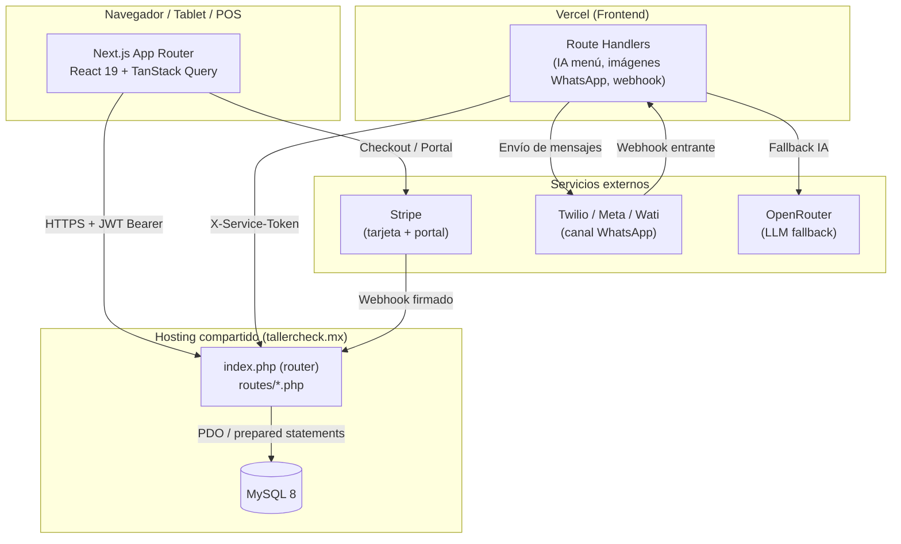
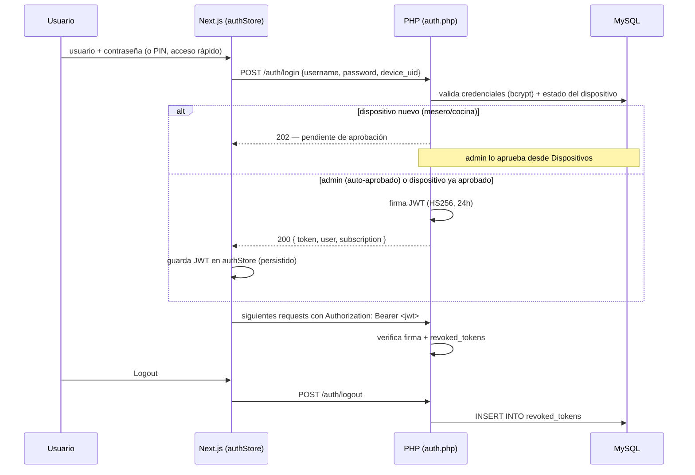
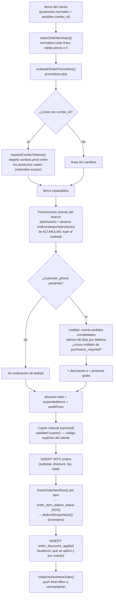
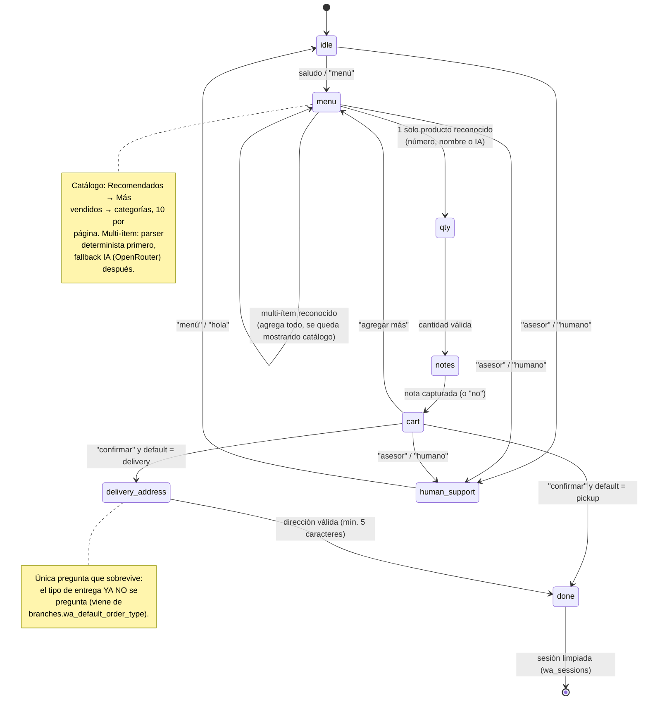
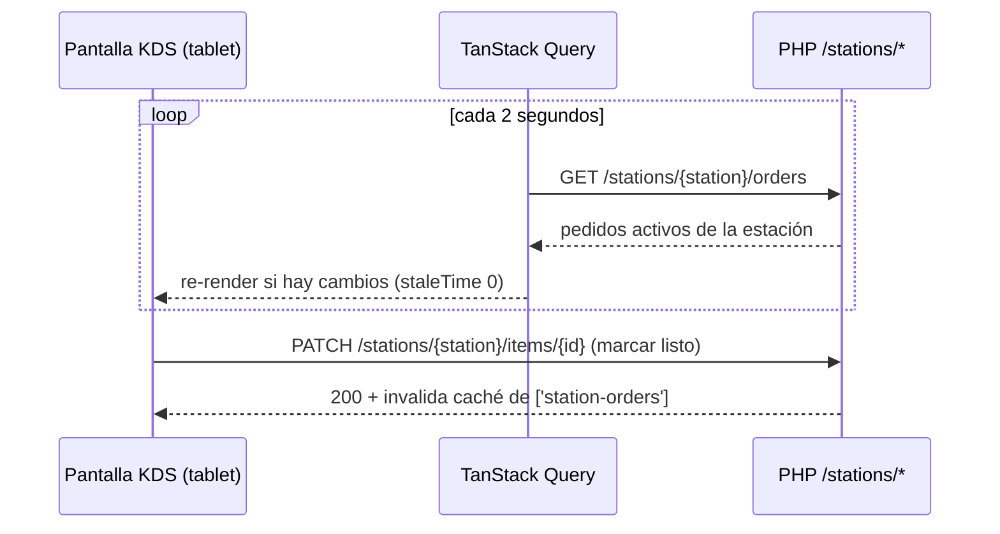
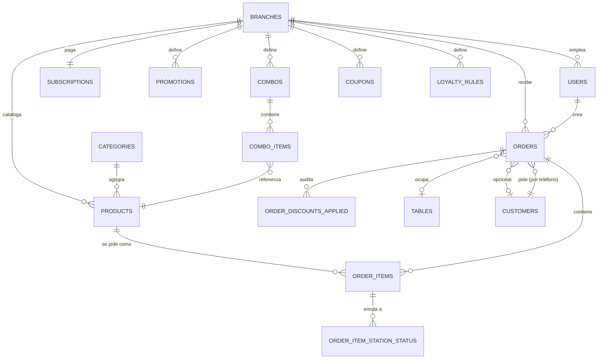
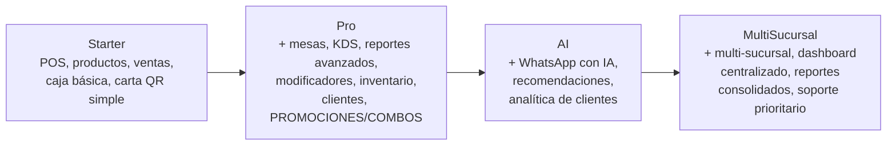
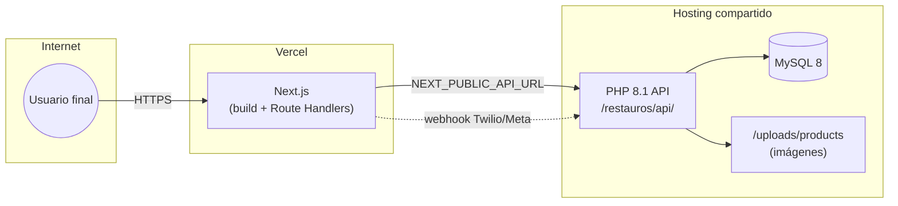

# Stack técnico y arquitectura — FoodIX

Documento de referencia técnica: todo el stack de desarrollo, cómo se integran las
piezas y los flujos principales del sistema, con diagramas. Para guías de uso
funcional ver el [Manual de Usuario](USER_MANUAL.md); para el detalle de cada
endpoint ver [API.md](API.md).

## Índice

1. [Resumen](#1-resumen)
2. [Stack — Frontend](#2-stack--frontend)
3. [Stack — Backend](#3-stack--backend)
4. [Integraciones externas](#4-integraciones-externas)
5. [Arquitectura general](#5-arquitectura-general)
6. [Autenticación y control de dispositivos](#6-autenticación-y-control-de-dispositivos)
7. [Creación de pedido + ejecución de promociones/combos/lealtad](#7-creación-de-pedido--ejecución-de-promocionescomboslealtad)
8. [Bot de pedidos por WhatsApp — máquina de estados](#8-bot-de-pedidos-por-whatsapp--máquina-de-estados)
9. [Tiempo real: KDS y Device Center](#9-tiempo-real-kds-y-device-center)
10. [Modelo de datos (simplificado)](#10-modelo-de-datos-simplificado)
11. [Planes y feature-gating](#11-planes-y-feature-gating)
12. [Topología de despliegue](#12-topología-de-despliegue)
13. [Convenciones de código](#13-convenciones-de-código)
14. [Deuda técnica conocida](#14-deuda-técnica-conocida)

---

## 1. Resumen

FoodIX es un **monolito frontend en Next.js** (desplegado en Vercel) que habla,
por HTTP + JWT, con un **backend PHP puro** (sin framework, sin ORM) desplegado en
hosting compartido (`tallercheck.mx`), respaldado por **MySQL 8**. No hay
WebSockets ni SSE: todo lo "en tiempo real" (KDS, Device Center, sesión de
WhatsApp) es **polling** vía TanStack Query con intervalos cortos (2–5 s), una
decisión deliberada para mantener el backend simple y compatible con hosting
compartido económico.

Tres integraciones de terceros hacen el trabajo pesado que el backend propio no
reinventa: **Stripe** (cobro con tarjeta), **Twilio/Meta/Wati** (canal de
WhatsApp) y **OpenRouter** (LLM, usado como *fallback* determinista-primero en
tres puntos: generación de descripciones de menú, interpretación de pedidos por
WhatsApp en lenguaje libre, y comanda por voz del mesero).

---

## 2. Stack — Frontend

| Tecnología | Versión (package.json) | Uso |
|---|---|---|
| Next.js | 15.5.18 (App Router) | Framework principal — Route Handlers para lo que debe correr en servidor (IA, imágenes) |
| React | 19.0.0 | UI |
| TypeScript | 5.x, `strict` | Tipado estático en todo el frontend |
| Tailwind CSS | 3.4.1 | Estilos, con `postcss.config.mjs` clásico |
| Zustand | 5.0.13 | Estado global (`authStore`, `configStore`, `orderDraftStore` del módulo Mesero) |
| TanStack Query | 5.100.14 | Fetching, caché y polling de todo el API PHP |
| Radix UI (`@radix-ui/react-*`) + shadcn/ui | 1.x/2.x por paquete | Primitivos accesibles (Dialog, Tabs, Select, Switch, Dropdown…) sobre los que se construyen `components/ui/*` |
| React Hook Form | 7.76.1 | Formularios |
| Zod | 4.4.3 | Validación de esquemas (`lib/validators/schemas.ts`) |
| Recharts | 3.8.1 | Gráficas de ventas |
| Framer Motion | 12.42.2 | Animaciones del módulo **Mesero** (bottom sheets, carrito flotante) |
| jsPDF + jspdf-autotable | 4.2.1 / 5.0.8 | Exportar reportes de ventas a PDF |
| web-push | 3.6.7 | Envío de notificaciones push (Device Center, avisos de cocina) |
| sharp | 0.34.3 | Conversión de imágenes en servidor (ej. fotos de producto `.webp` → `.jpeg` para WhatsApp) |
| date-fns | 4.3.0 (locale `es`) | Fechas en español |
| react-dropzone | 15.0.0 | Arrastrar y soltar imágenes (menú y logotipo) |
| swiper | 12.2.0 | Galerías y navegación horizontal en componentes compatibles |
| react-qr-code | 2.0.21 | QR de la Carta pública y del ticket |
| next-themes | 0.4.6 | Modo oscuro/claro |
| Sonner | 2.0.7 | Notificaciones toast |
| Lucide React | 1.16.0 | Iconografía UI |
| Stripe.js (`@stripe/stripe-js`, `@stripe/react-stripe-js`) | 9.7.0 / 6.5.0 | Checkout de tarjeta en el navegador |
| Vitest + Testing Library | 4.1.7 / 16.3.2 | Pruebas unitarias/componentes |

**Patrón de datos:** ningún estado remoto vive fuera de TanStack Query — los hooks
en `lib/api/queries/*.ts` son la única puerta al API PHP (`apiRequest()` en
`lib/api/client.ts`, wrapper de `fetch` con Bearer JWT + manejo de 401/409).

---

## 3. Stack — Backend

| Tecnología | Uso |
|---|---|
| PHP 8.1+ | API REST propia, sin framework — un router (`index.php`) + `routes/*.php` por dominio |
| MySQL 8 (InnoDB) | Base de datos única; migraciones incrementales idempotentes en `php-backend/migrations/` (01 → 34 a la fecha) |
| PDO | Acceso a datos — **prepared statements en el 100% de las consultas**, sin excepción |
| JWT (HS256, manual) | Autenticación stateless, sin librería — firma/verificación implementada a mano en `config/jwt.php` |
| bcrypt (`password_hash`, cost 12) | Hash de contraseñas |
| GD | Recodificación de imágenes subidas (elimina EXIF, valida MIME real) |

**Por qué sin framework:** el backend corre en hosting compartido barato
(el mismo host sirve `tallercheck.mx/restauros/api/`), donde instalar Composer o
un framework completo no siempre es viable. El router de `index.php` resuelve la
ruta a mano (`$seg = explode('/', ...)`) y despacha a la función correspondiente
en `routes/*.php` — sin auto-loading mágico, sin contenedor de DI.

**Sin FOREIGN KEY en tablas nuevas:** las migraciones desde la `25-whatsapp.sql`
en adelante evitan declarar `FOREIGN KEY` hacia `branches`/`orders` — en este
hosting compartido esas tablas no siempre admiten ser referenciadas por InnoDB
(motor/charset heredado), lo que provoca el error 150 de MySQL. La integridad
por `branch_id`/`order_id` se mantiene desde la capa de aplicación, con índices
normales para el rendimiento.

---

## 4. Integraciones externas

| Servicio | Para qué | Dónde vive en el código |
|---|---|---|
| **Stripe** | Cobro de suscripción con tarjeta + Billing Portal | `app/api/checkout/`, `php-backend/routes/webhooks/stripe.php`, `php-backend/config/stripe.php` |
| **SPEI (transferencia bancaria manual)** | Alternativa a Stripe — referencia única + reporte de pago + aprobación manual del superadmin | `app/api/spei-intent/`, `php-backend/routes/billing.php` |
| **Twilio / Meta Cloud API / Wati** | Canal de WhatsApp (multi-proveedor, abstracto en `lib/server/wati.ts`) | `app/api/whatsapp/webhook/route.ts`, `lib/server/whatsapp*.ts` |
| **OpenRouter (LLM)** | (a) Generación de descripción/ingredientes de un platillo con IA · (b) Fallback de interpretación de lenguaje libre en el bot de WhatsApp (`whatsappAI.ts`) · (c) Comanda por voz del mesero (`routes/ordenes.php`) | `app/api/ai/product-content/`, `lib/server/whatsappAI.ts`, `php-backend/routes/ordenes.php` — todas degradan en silencio (nunca rompen el flujo) si no hay `OPENROUTER_API_KEY` configurada |
| **Vercel** | Hosting del frontend Next.js (`restaurosapp.vercel.app`) | — |
| Hosting compartido (`tallercheck.mx`) | Hosting del backend PHP + MySQL | `php-backend/` |

Ninguna integración es dura: Stripe cae a SPEI si no hay llaves, WhatsApp puede
correr sin el fallback de IA (solo con el parser determinista), y el generador
de descripciones simplemente no aparece en el menú si falta la key.

---

## 5. Arquitectura general

---

## 6. Autenticación y control de dispositivos

---

## 7. Creación de pedido + ejecución de promociones/combos/lealtad

Camino compartido por POS (`handleCreateOrder`, `orders.php`) y WhatsApp
(`waCreateOrder`, `whatsapp.php`) — ambos delegan la parte de descuentos
automáticos al mismo helper para no duplicar la lógica de negocio.

**Dónde se ve el resultado:** el desglose de `order_discounts_applied` se
adjunta en `attachItems()` y se renderiza en `OrderSummary.tsx` (detalle del
pedido) y en el ticket impreso (`escpos.ts` / `receiptHtml.ts`).

---

## 8. Bot de pedidos por WhatsApp — máquina de estados

**Idempotencia:** cada mensaje entrante con `MessageSid` (Twilio) se registra en
`wa_messages.provider_message_id` (índice único); un reintento del webhook se
detecta y se descarta sin reprocesar. Cada pedido confirmado se huellea por
`(branch_id, phone, cart_hash)` en `wa_order_dedup` con ventana de 2 minutos,
para que un doble "confirmar" no cree dos pedidos.

---

## 9. Tiempo real: KDS y Device Center

No hay WebSockets ni Server-Sent Events reales en producción — todo lo que se
siente "en vivo" es **polling** de TanStack Query:

El **Device Center** (monitoreo de dispositivos conectados) sigue el mismo
patrón: cada dispositivo manda un *heartbeat* periódico
(`POST /device-monitor/heartbeat`) y el panel de superadmin hace polling de
`GET /device-monitor` para pintar el estado online/idle/offline.

> Esta elección (polling en vez de WebSockets) es deliberada: simplifica el
> backend PHP sin framework y evita depender de un proceso persistente en un
> hosting compartido que no lo garantiza.

---

## 10. Modelo de datos (simplificado)

Solo las relaciones centrales — el esquema completo vive en
`php-backend/schema.sql` + `php-backend/migrations/*.sql`.

---

## 11. Planes y feature-gating

Cuatro planes: **Starter → Pro → AI → MultiSucursal** (migración
`32-plan-rename.sql`; nombres previos: Basic/Pro/Enterprise). Cada plan es un
superconjunto acumulativo de funciones del anterior.

**Una sola fuente de verdad por lado:**
- Backend: `licenseForPlan()` + `requirePlanFeature()` / `requirePlanLimit()` en `php-backend/config/subscription_helpers.php`
- Frontend: `LICENSE_BY_PLAN` en `lib/constants/subscription.ts`, consumido por el hook `usePlanFeature()` y el componente `<FeatureLock feature="..." planSugerido="...">` que envuelve pantallas completas (Promociones, Inventario) con un overlay de upgrade.

---

## 12. Topología de despliegue

**Migraciones:** se corren a mano, en orden, contra la base del hosting
(`for f in $(ls php-backend/migrations/*.sql | sort); do mysql ... < "$f"; done`)
— no hay pipeline de migraciones automatizado (ver
[`docs/DEPLOY-CHECKLIST.md`](DEPLOY-CHECKLIST.md)).

---

## 13. Convenciones de código

- **TypeScript estricto en todo el frontend**; los tipos de `lib/types/index.ts`
  usan `snake_case` deliberadamente — reflejan 1:1 la forma real de las
  respuestas del API PHP, para no traducir entre convenciones en cada hook.
- **El backend siempre recalcula totales** — el frontend nunca manda
  `subtotal`/`total` de confianza; sirven solo para la vista previa antes de
  enviar.
- **Migraciones idempotentes**: todo `ALTER TABLE`/`CREATE TABLE` nuevo revisa
  `INFORMATION_SCHEMA` antes de ejecutar, para poder correr el archivo más de
  una vez sin error (patrón usado desde la migración `22-branch-tax-config.sql`
  en adelante).
- **Design tokens en HSL** (`app/globals.css`, tema claro/oscuro) — color de
  marca `#E85D04` ("FoodIX Orange"). Detalle completo en el
  [README](../README.md#paleta-de-colores).
- **Degradación silenciosa de IA**: cualquier punto que use OpenRouter
  (descripciones de menú, fallback de WhatsApp, voz del mesero) nunca rompe el
  flujo si falta la key o la llamada falla — simplemente no aporta nada y el
  camino determinista sigue solo.

---

## 14. Deuda técnica conocida

- **`utils/supabase/{client,server,middleware}.ts`** — vestigio de un
  scaffold inicial con Supabase; **no se usa en ningún lugar del código activo**
  (el backend real es PHP + MySQL). Candidato a eliminar en una limpieza futura.
- **Módulo "Mesero" (toma de pedidos mobile-first)** — código funcional
  (`app/mesero/`, `components/mesero/`, comanda por voz vía OpenRouter en
  `routes/ordenes.php`) pero **sin enlace en la navegación** (`MobileNav`/
  `Sidebar`) — no es alcanzable por un usuario real todavía.
- **Combos vía WhatsApp** — no están disponibles: el catálogo que recibe el
  bot (`fetchMenu()`) solo trae productos normales, los combos no se mezclan
  ahí. Un cliente que escriba el nombre de un combo por WhatsApp no lo
  encontrará — combos son, por ahora, exclusivos del selector en el POS
  (`ComboPicker.tsx`). Queda como fase futura explícita.
