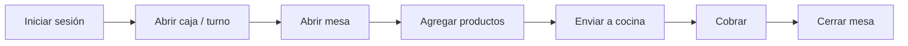

# Guía de Mesero — FoodIX

Todo lo que necesitas para atender mesas, tomar pedidos y cobrar. Lenguaje directo y al grano.

## Tu día en 7 pasos

### 1. Iniciar sesión
Entra con tu **usuario** y **contraseña**. Verás Pedidos, Mesas y Caja.

### 2. Abrir caja / iniciar turno
> Menú → **Caja** → **Abrir caja**. **Obligatorio antes de cobrar.**

Captura el **monto inicial** y pulsa **Iniciar turno**. Si intentas cobrar sin caja, aparece el aviso *"Para continuar necesitas abrir caja o iniciar turno"* → pulsa **Abrir caja ahora**.

### 3. Abrir mesa
> Menú → **Mesas**. Toca una mesa **libre**: se crea su pedido.

También puedes hacer pedidos **Para llevar** o **Domicilio** desde **Pedidos**.

### 4. Agregar productos
- Toca los productos para añadirlos; ajusta cantidades.
- Elige **modificadores** (término, extras, sin ingrediente).
- Productos **por kilo** o **precio abierto**: captura el valor.
- Agrega **notas** (ej. *sin picante*).

### 5. Modificar el pedido
Puedes agregar o quitar productos mientras el pedido no esté pagado. Cancelar un producto **en preparación** puede requerir autorización de un admin.

### 6. Enviar a cocina
Pulsa **Enviar a cocina**: el pedido aparece al instante en la pantalla **KDS** de la estación correcta.

### 7. Cobrar y cerrar mesa
> Requiere **caja abierta**.

1. Abre el pedido → **Cobrar**.
2. Elige método: efectivo, tarjeta, transferencia, monedero u otro.
3. Efectivo: captura lo recibido → el sistema da el **cambio**.
4. Si hace falta, **divide la cuenta** (por productos, personas o monto).
5. Confirma. La mesa se **libera** y el pedido queda **pagado**.

---

## Consejos
- Mantén tu **turno de caja** abierto durante tu jornada; ciérralo al terminar para el corte.
- Si una pantalla se quedó en segundo plano mucho tiempo, **recárgala** para ver datos frescos.
- ¿Dudas rápidas? Abre el **Centro de Ayuda** (`/help`).

📖 Relacionado: [Guía de Caja](CASHIER_GUIDE.md) · [FAQ](FAQ.md) · [Solución de Problemas](TROUBLESHOOTING.md)
